# FuzzyWuzzy

###### Etymology

george - enough said

## Installation

In the project root (requires sudo):

```bash
./install
```

If the project gives a `command not found` error, check that the `pip` script directory (typically `~/.local/bin`) is in your `PATH`.

## Usage

In the project root:

```bash
./fuzzer <binary> <sample_input>
```

Alternatively, in any directory on your system:

```bash
fuzzywuzzy <binary> <sample_input>
```

## Current Functionality

-   Finds inputs to crash plaintext[123], json[12], csv[12], and xml[123].
-   Outputs the first crashing input to a file `bad.txt`.
-   Features in-memory reset for 32-bit executables.
-   Traces common libc function calls for coverage-based mutation.
-   Has simple timeout detection.
-   Uses the following mutation strategies:
    -   bit flips, byte flips, known ints
    -   repeated parts, keyword extraction, arithmetic
    -   coverage based mutations

## Design

-   Modular
    -   FuzzyWuzzy is designed to allow new fuzzing strategies to be implemented with extremely minimal changes to existing code. Strategies are formed through a combination of `Hunters` and `Mutators`.
-   Hunters
    -   Hunters, defined for each file input type, find bytes of interest in the sample input which can be mutated to potentially produce an input that might crash the program.
    -   These bytes are passed onto mutators (see below) that return mutated (or replacement) bytes. The hunter then serialises the mutated bytes back into the original input.
        -   This allows for a mutator to include, for example, backslashes in a JSON string, or a length field in a binary format to be updated based on the modification made to the field it descibes - of course, some hunters may choose to skip these steps to see what breaks.
    -   Targeting specific bytes for mutation allows us to continue to provide valid inputs to programs which expect inputs to adhere to certain file formats, such that the target binary doesn't early-exit.
    -   Each hunter then also defines which mutatators can change the selected bytes.
-   Mutators
    -   Mutators receive a specific byte input from a hunter, which they change in some predefined way, depending on the mutator.
    -   Some example mutators flip random bits, repeat segments (e.g. lines), attempt buffer overflows, replace numbers with known integers, etc.
    -   Mutator inputs are run in a round robin fashion, such that we try as wide a range of strategies as possible, when the target may not necessarily be vulnerable to all the bug types a certain mutator targets.
-   Harness
    -   FuzzyWuzzy uses `LD_PRELOAD` to intercept libc functions at runtime. By intercepting `__libc_start_main`, we capture initial program state for an in-memory reset.
        -   In initial program start-up, the harness saves all writable mememory and register data.
        -   By calling the program's main as a function directly, and through replacing exit and abort, we are able to intercept program exits and perform an in-memory reset, by replacing all writable memory with our saved data.
        -   In some cases, we saw performance improvements up to 10x, even with tracing enabled.
    -   As we are able to intercept any libc function call through `LD_PRELOAD`, we have put wrappers around common libc functions to track their execution, allowing for coverage tracking.
        -   These wrappers are extremely lightweight, offering a much lower performance overhead than using ptrace/ltrace whilst still providing coverage functionality.
        -   This data is extracted using a UNIX domain socket connection to the main Python fuzzer.
-   Coverage based mutations
    -   On each execution, a log of libc calls is saved, each event including the function name and return address.
        ```json
        [
            ["libc_call", "signal", 134517417],
            ["libc_call", "printf", 134517465],
            ["libc_call", "printf", 134517305],
            ["libc_call", "fgets", 134517332]
            // ...
        ]
        ```
    -   Events across multiple runs are combined together to create a tree of events. If a particular mutated input causes new events to appear that were not in the tree, this input is used as another sample input that all mutations are then run on again, allowing us to stack new mutations on top of mutations that we know find new execution paths.
    -   This list of inputs is then run via a weighted round robin, with each input's weight being the number of new events it uncovered.
    -   This data is also used to generate a diagram of program execution when a bad input is found, to aid in finding the vulnerable point in the program. An example for `plaintext2` can be found at the end of this writeup. The red path indicates the path taken when given the bad input.

## Something Awesome: The Harness

-   We understand this is a standard requirement for this assignment, however, we believe our harness functionality exceeds that required by the assignment and meets the "something awesome" criteria.
-   Hooks libc calls to provide 🔥 BLAZINGLY FAST 🔥 coverage based mutations.
-   Resets all of writable memory (by parsing `/proc/self/maps`) on every reset (except for our own globals, of course), while achieving up to 10k runs/sec on some programs. 
-   Watching `mmap` and `signal` calls to track which needs to be reset.
-   Uses `getcontext` and `setcontext` to escape from custom signal handlers and reset the binary, even if `exit` is called in one.
-   Uses extended asm to increase portability, should work on ANY 32-bit CPU.
-   Closes and reopens STDIN (on the Python side) to emulate regular EOF behaviour.
-   C Macros (see src/fuzzer/harness/hooks.h) for automatic wrapper generation.
-   Notable events and coverage reporting is provided to the user upon crash detection to aid further investigation.

## Further Goals

-   More mutation stratgies
    -   With it's extremely fast harness, FuzzyWuzzy often runs out of mutations. We should define further infinite mutations to maximise total coverage
-   64-bit harness support
    -   The harness relies on some hand written assembly to directly manipulate program data. This asm is written for pure x86, despite the majority being compatible with x86_64. Despite an effort to translate it, some bugs were encountered leading to us to disable this functionality for now.
-   Runtime coverage
    -   Generate function wrappers upon initially fuzzing a binary (for libc, other libraries, and the target itself) for improved coverage metrics.
-   Better coverage metrics (and use of them)
    -   Currently, coverage is based on the sequence of libc calls made. Even without more data, more can be done to analyse these events and the binary to get a more accurate understanding of how an input is interacting with the binary, for uses such as infinite loop detection (currently just a 1 second timeout) and more accurate weighting of different mutations.

## Coverage Diagram Example

```mermaid
flowchart TD
    prog_start["Program Start"]
    libc_call-signal-134517417-0["signal\n0x80492a9"]
    prog_start-->libc_call-signal-134517417-0
    libc_call-printf-134517465-1["printf\n0x80492d9"]
    libc_call-signal-134517417-0-->libc_call-printf-134517465-1
    libc_call-printf-134517305-2["printf\n0x8049239"]
    libc_call-printf-134517465-1-->libc_call-printf-134517305-2
    libc_call-fgets-134517332-3["fgets\n0x8049254"]
    libc_call-printf-134517305-2-->libc_call-fgets-134517332-3
    libc_call-strchr-134517364-4["strchr\n0x8049274"]
    libc_call-fgets-134517332-3-->libc_call-strchr-134517364-4
    libc_call-puts-134517537-5["puts\n0x8049321"]
    libc_call-strchr-134517364-4-->libc_call-puts-134517537-5
    libc_call-printf-134517576-6["printf\n0x8049348"]
    libc_call-puts-134517537-5-->libc_call-printf-134517576-6
    libc_call-printf-134517576-7["printf\n0x8049348"]
    libc_call-printf-134517576-6-->libc_call-printf-134517576-7
    libc_call-printf-134517576-8["printf\n0x8049348"]
    libc_call-printf-134517576-7-->libc_call-printf-134517576-8
    libc_call-printf-134517576-9["printf\n0x8049348"]
    libc_call-printf-134517576-8-->libc_call-printf-134517576-9
    libc_call-puts-134517602-10["puts\n0x8049362"]
    libc_call-printf-134517576-9-->libc_call-puts-134517602-10
    libc_call-printf-134517305-11["printf\n0x8049239"]
    libc_call-puts-134517602-10-->libc_call-printf-134517305-11
    libc_call-fgets-134517332-12["fgets\n0x8049254"]
    libc_call-printf-134517305-11-->libc_call-fgets-134517332-12
    libc_call-strchr-134517364-13["strchr\n0x8049274"]
    libc_call-fgets-134517332-12-->libc_call-strchr-134517364-13
    libc_call-malloc-4157078149-14["malloc\n0xf7c7fa85"]
    libc_call-strchr-134517364-13-->libc_call-malloc-4157078149-14
    libc_call-free-4157071031-15["free\n0xf7c7deb7"]
    libc_call-malloc-4157078149-14-->libc_call-free-4157071031-15
    exit-0-16["Exit\nwith code: 0"]
    libc_call-free-4157071031-15-->exit-0-16
    libc_call-puts-134517644-14["puts\n0x804938c"]
    libc_call-strchr-134517364-13-->libc_call-puts-134517644-14
    libc_call-exit-134517657-15["exit\n0x8049399"]
    libc_call-puts-134517644-14-->libc_call-exit-134517657-15
    libc_call-malloc-4157078149-16["malloc\n0xf7c7fa85"]
    libc_call-exit-134517657-15-->libc_call-malloc-4157078149-16
    libc_call-free-4157071031-17["free\n0xf7c7deb7"]
    libc_call-malloc-4157078149-16-->libc_call-free-4157071031-17
    exit-0-18["Exit\nwith code: 0"]
    libc_call-free-4157071031-17-->exit-0-18
    libc_call-puts-134517511-5["puts\n0x8049307"]
    libc_call-strchr-134517364-4-->libc_call-puts-134517511-5
    libc_call-exit-134517524-6["exit\n0x8049314"]
    libc_call-puts-134517511-5-->libc_call-exit-134517524-6
    libc_call-malloc-4157078149-7["malloc\n0xf7c7fa85"]
    libc_call-exit-134517524-6-->libc_call-malloc-4157078149-7
    libc_call-free-4157071031-8["free\n0xf7c7deb7"]
    libc_call-malloc-4157078149-7-->libc_call-free-4157071031-8
    exit-0-9["Exit\nwith code: 0"]
    libc_call-free-4157071031-8-->exit-0-9
    exit-0-7["Exit\nwith code: 0"]
    libc_call-exit-134517524-6-->exit-0-7
    prog_end["Program crashed\nSIGSEGV (11)"]
    style prog_start fill:#ff0000
    style libc_call-signal-134517417-0 fill:#ff0000
    style prog_end fill:#ff0000
    style prog_start fill:#ff0000
    style libc_call-printf-134517465-1 fill:#ff0000
    style prog_end fill:#ff0000
    style prog_start fill:#ff0000
    style libc_call-printf-134517305-2 fill:#ff0000
    style prog_end fill:#ff0000
    style prog_start fill:#ff0000
    style libc_call-fgets-134517332-3 fill:#ff0000
    style prog_end fill:#ff0000
    style prog_start fill:#ff0000
    style libc_call-strchr-134517364-4 fill:#ff0000
    style prog_end fill:#ff0000
    style prog_start fill:#ff0000
    style libc_call-puts-134517537-5 fill:#ff0000
    style prog_end fill:#ff0000
    style prog_start fill:#ff0000
    style libc_call-printf-134517576-6 fill:#ff0000
    style prog_end fill:#ff0000
    style prog_start fill:#ff0000
    style libc_call-printf-134517576-7 fill:#ff0000
    style prog_end fill:#ff0000
    style prog_start fill:#ff0000
    style libc_call-printf-134517576-8 fill:#ff0000
    style prog_end fill:#ff0000
    style prog_start fill:#ff0000
    style libc_call-printf-134517576-9 fill:#ff0000
    style prog_end fill:#ff0000
    style prog_start fill:#ff0000
    style libc_call-puts-134517602-10 fill:#ff0000
    style prog_end fill:#ff0000
    style prog_start fill:#ff0000
    style libc_call-printf-134517305-11 fill:#ff0000
    style prog_end fill:#ff0000
    style prog_start fill:#ff0000
    style libc_call-fgets-134517332-12 fill:#ff0000
    style prog_end fill:#ff0000
    style prog_start fill:#ff0000
    style libc_call-strchr-134517364-13 fill:#ff0000
    style prog_end fill:#ff0000
    libc_call-strchr-134517364-13-->prog_end
```


